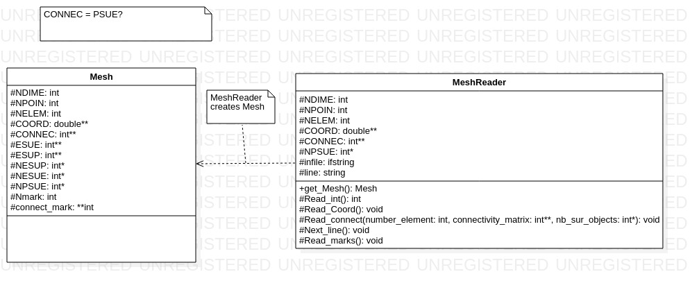
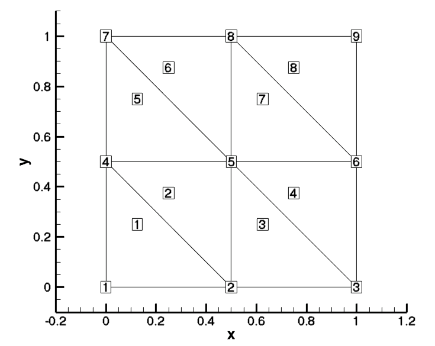

# Gestion du maillage

Le symbole :question: indique une incertitude. Ces informations risquent de changer.  

## Structure général
La classe MeshReader cré une instance de la classe Mesh à partir de lien vers un fichier de [format SU2](https://su2code.github.io/docs/Mesh-File/).

## Format des variables

### NDIME : int
Nombre de dimension du maillage.
### NPOIN : int
Nombre de points du maillage
### NELEM : int
Nombre d'éléments du maillage
### COORD : double[NPOIN][NDIME]
Contient les coordonnées cartésiennes de chaque point du maillage.
|     | **X**  | **Y**  |
|-----|----|----|
| **P1**  | x1 | y1 |
| **P2**  | x2 | y2 |
| **P3**  | x3 | y3 |
| ... |  ...  |  ...  |

### CONNEC : [NELEM][dépend du type d'élément]
:question: Pourrais être appellé PSUE
Voir la section example pour comprendre le lien entre CONNEC et NPSUE

|            | **node 1** | **node 2** | **node 3** | **node 4** | ... |
|------------|------------|------------|------------|------------|-----|
| **elem 1** | #point     | #point     |            |            |     |
| **elem 2** | #point     | #point     | #point     | #point     |     |
| **elem 3** | #point     | #point     | #point     |            |     |
| ...        |            |            |            |            |     |

### NPSUE : int[NELEM]
**N**umber of **P**oints **SU**rrounding each **E**lement
:question: cet array pourrait plutôt garder en mémoire le type d'élément.

|            | **elem 1** | **elem 2** | **elem 3** | ...|
|------------|------------|------------|------------|------------|
| **Number of points** |  2    |   4   |   3         |            |

## Exemple
Cette exemple est pris de la [documentation du format SU2](https://su2code.github.io/docs/Mesh-File/)

NDIME = 2

NPOIN = 9

NELEM = 8

COORD =
|| **X**  | **Y**  |
|----|----|----|
**P1**|0.00000000000000| 0.00000000000000
**P2**|0.50000000000000| 0.00000000000000
**P3**|1.00000000000000| 0.00000000000000
**P4**|0.00000000000000| 0.50000000000000
**P5**|0.50000000000000| 0.50000000000000
**P6**|1.00000000000000| 0.50000000000000
**P7**|0.00000000000000| 1.00000000000000
**P8**|0.50000000000000| 1.00000000000000
**P9**|1.00000000000000| 1.00000000000000

CONNEC =
|            | **node 1** | **node 2** | **node 3** | **node 4** | ... |
|------------|------------|------------|------------|------------|-----|
| **elem 1** | 0     | 1     | 3            |            |     |
| **elem 2** | 1     | 4     | 3     |            |     |
| **elem 3** | 1     | 2     | 4     |            |     |
| **elem 4** | 2     | 5     | 4     |            |     |
| **elem 5** | 3     | 4     | 6     |            |     |
| **elem 6** | 4     | 7     | 6     |            |     |
| **elem 7** | 4     | 5     | 7     |            |     |
| **elem 8** | 5     | 8     | 7     |            |     |

NPSUE = 
|            | **E1** | **E2** | **E3** | **E4**|**E5**|**E6**|**E7**|**E8**|
|------------|------------|------------|------------|------------|------------|------------|------------|------------|
| **Number of points** |  3|3|3|3|3|3|3|3|

### exemples d'utilisation de la matrice de connectivité CONNEC
On veut trouver le deuxième point de l'élément 4

    pointID = CONNEC[3][1];  // Attention à l'indexation en zéro de C++
    // pointID = 5

On veut itérer sur chaque point de l'élément 7

    ielem = 6;
    nnodes = NPSUE[ielem];
    for(int point_local_id = 0; point_local_id < nnodes; point_local_id)
    {
        point_global_id = CONNEC[ielem][point_local_id];
        // Do you magic
    }